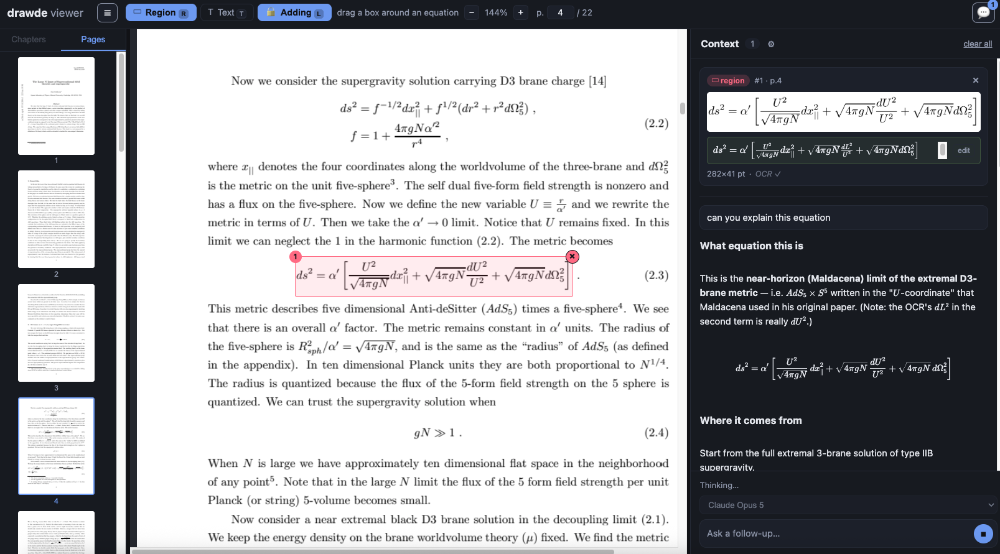

<div align="center">

# drawde

**Read physics papers with an AI that can see the equations.**

Box any equation in a PDF, and ask about it. Equation OCR runs entirely in your
browser; the chat uses your own API key.

</div>

<div align="center">
  
</div>

---

## Why

Papers suppress steps. *"It can be shown that…"*, *"after a straightforward
calculation…"* — and the reader is left reconstructing three pages of algebra.

The tools that exist solve the wrong halves of this. Homework solvers take a
photo of a problem and hand back an answer, with no idea what paper it came
from. PDF→LaTeX converters transcribe a document and stop there. LaTeX editors
are snippet playgrounds detached from any source.

drawde makes **the paper the first-class object**: select a region, and the
question is answered with the crop, the OCR'd LaTeX, and the surrounding
context all in hand.

## Open any paper from the address bar

Put a PDF link straight after the host:

```
drawde.tchlabs.net/https://arxiv.org/pdf/1907.04392
```

Several shapes work, because none of them should need explaining:

| You paste | What happens |
|---|---|
| `…/https://arxiv.org/pdf/1907.04392` | opens it |
| `…/arxiv.org/pdf/1907.04392` | `https://` is optional |
| `…/https://arxiv.org/abs/2510.01051` | abstract pages resolve to the PDF |
| `…/2510.01051` | a bare arXiv id is enough |
| `…/` | landing page — drag in a PDF, or open the demo |

Dropped files never leave your machine. Remote PDFs are fetched by your browser
directly when the host allows it (arXiv does), and proxied through the server
only when it doesn't.

## How it works

```
   ▭ box an equation
        │
        ├─ high-DPI crop      ─┐
        ├─ Texo OCR → LaTeX    ├─→  one prompt  →  streamed answer
        └─ PDF text layer     ─┘
```

Three channels rather than one, because they fail differently. The **image** is
authoritative for layout. **OCR** gives editable LaTeX. The **text layer** —
glyph soup though it is — disambiguates symbols the image alone leaves
ambiguous (`ν` vs `v`, `α` vs `a`).

It works. In the screenshot above the model notices the OCR misread `dU²` as
`dL²` and corrects it, because it can see the crop as well as the transcription.

**Equation OCR is local.** [Texo](https://github.com/alephpi/Texo) (20M params,
~80 MB, ONNX via transformers.js) runs in a Web Worker — no API key, no upload,
~1 s per equation once warm.

**Chat is bring-your-own-key.** Anthropic, OpenAI, Gemini and Moonshot are
supported; only models whose provider has a key are offered. Keys live in
`sessionStorage` by default (gone when the tab closes), `localStorage` only if
you ask, and each is sent only to its own provider. drawde has no backend that
sees them.

## Features

- **Region + text selection**, unified — both produce the same `Region` object
- **Lock selection** to build up multi-part context (or hold <kbd>Shift</kbd>)
- **Editable OCR** — a modal with the original crop, live KaTeX preview, and the source
- **Rendered answers** — markdown + LaTeX, sanitised before display
- **Mobile** — single-pane layout, overlay panels, pan/pinch
- Outline, page thumbnails, in-document search, keyboard navigation

## Run it locally

```bash
git clone git@github.com:tch1001/drawde.git
cd drawde/app && npm install && npx vite build
cd .. && node server/serve.mjs --port 8080
```

Then open <http://127.0.0.1:8080/>.

The server exists for two things a static host can't do on its own: serving the
app for *any* path (so the URL-prefix trick works), and `/_proxy` for PDFs whose
host refuses cross-origin requests.

For development with hot reload: `cd app && npx vite` (port 5180).

## Tests

```bash
cd app && npm run test:e2e     # typecheck, then 22 Playwright tests
```

The suite drives **real input** — `page.mouse`, `page.keyboard`, touch taps —
never synthetic events. That is deliberate: an early bug where the browser's
native image-drag silently cancelled the pointer stream passed every synthetic
test and failed under an actual mouse.

`npm run test:e2e` typechecks first, because `vite build` does not — it once
happily bundled a missing import that would have crashed at runtime.

## Stack

| | |
|---|---|
| Viewer | [EmbedPDF](https://github.com/embedpdf/embed-pdf-viewer) headless plugins (PDFium/WASM) |
| OCR | [Texo](https://github.com/alephpi/Texo) / `alephpi/FormulaNet` via `@huggingface/transformers` |
| Maths | KaTeX |
| UI | React + Vite |

## Licence note

Texo is **AGPL-3.0** and its weights are shipped to the browser. OCR sits behind
an `OcrEngine` interface so it can be swapped for a permissively-licensed or
server-side model if that matters for your deployment.

---

<div align="center">
<sub>Built with <a href="https://claude.com/claude-code">Claude Code</a>.</sub>
</div>
